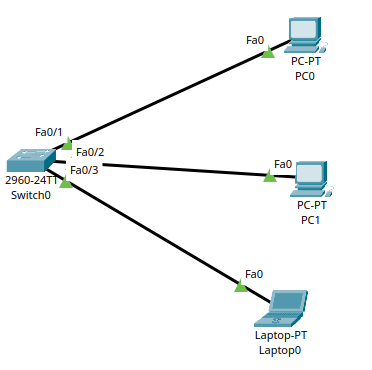
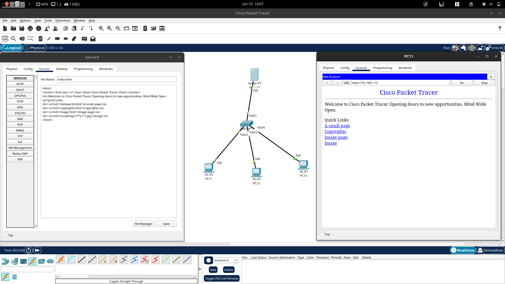

# Subnetting Notes

## IP Address Classes

| Class | Range | Default Mask | Prefix |
|---------|---------|---------|---------|
| A | 1 - 126 | 255.0.0.0 | /8 |
| B | 128 - 191 | 255.255.0.0 | /16 |
| C | 192 - 223 | 255.255.255.0 | /24 |
| D | 224 - 239 | Multicast | N/A |
| E | 240 - 255 | Experimental | N/A |

### Special Addresses

- 127.x.x.x → Loopback
- 0.0.0.0 → Default Route
- 255.255.255.255 → Broadcast

---

# Subnet Mask and Prefix

A prefix tells how many bits belong to the network.

Example:

```
192.168.1.0/24
```

- Network Bits = 24
- Host Bits = 8

Subnet Mask:

```
11111111.11111111.11111111.00000000
=
255.255.255.0
```

---

# Formula: Host Bits

```
Host Bits = 32 - Prefix
```

Example:

```
/24

Host Bits = 32 - 24
          = 8
```

---

# Formula: Usable Hosts

```
Usable Hosts = 2^(Host Bits) - 2
```

Why -2?

- One Network Address
- One Broadcast Address

Example:

```
/24

Hosts = 2^8 - 2
       = 256 - 2
       = 254
```

---

# Formula: Number of Networks

```
Number of Networks = 2^(Borrowed Bits)
```

Borrowed Bits = Bits carried from host portion.

Example:

```
Default Class C = /24

New Prefix = /27

Borrowed Bits = 27 - 24
              = 3

Networks = 2^3
         = 8
```

---

# Borrowing (Carrying) Bits

Example:

```
Class C Default

192.168.1.0/24
```

Need more subnets:

```
/26
```

Borrowed:

```
26 - 24 = 2 bits
```

Result:

```
Networks = 2^2 = 4

Hosts = 2^6 - 2
      = 62
```

---

# Block Size Formula

```
Block Size = 256 - Interesting Octet
```

Example:

```
Mask = 255.255.255.192
```

Interesting Octet:

```
192
```

Block Size:

```
256 - 192 = 64
```

Subnets:

```
0
64
128
192
```

---

# Range Formula

```
Current Subnet
to
Next Subnet - 1
```

Example:

```
192.168.1.64/26
```

Next Subnet:

```
192.168.1.128
```

Range:

```
192.168.1.64
to
192.168.1.127
```

---

# Broadcast Address

Formula:

```
Broadcast = Next Subnet - 1
```

Example:

```
Network = 192.168.1.64/26

Next Subnet = 192.168.1.128

Broadcast = 192.168.1.127
```

---

# Valid Host Range

Formula:

```
First Host = Network + 1

Last Host = Broadcast - 1
```

Example:

```
Network = 192.168.1.64

Broadcast = 192.168.1.127
```

Hosts:

```
192.168.1.65
to
192.168.1.126
```

---

# Right to Left = Host Calculation

Host bits are counted from the right.

Example:

```
/27

11111111.11111111.11111111.11100000
```

Host Bits:

```
00000
```

Host Count:

```
2^5 - 2
= 30
```

Rule:

```
Right → Left = Host Calculation
```

---

# Left to Right = Network Calculation

Network bits are counted from the left.

Example:

```
/27

11111111.11111111.11111111.11100000
```

Network Bits:

```
27
```

Rule:

```
Left → Right = Network Calculation
```

---

# Quick Reference Table

| Prefix | Mask | Usable Hosts |
|----------|----------|----------|
| /24 | 255.255.255.0 | 254 |
| /25 | 255.255.255.128 | 126 |
| /26 | 255.255.255.192 | 62 |
| /27 | 255.255.255.224 | 30 |
| /28 | 255.255.255.240 | 14 |
| /29 | 255.255.255.248 | 6 |
| /30 | 255.255.255.252 | 2 |
| /31 | 255.255.255.254 | Point-to-Point |
| /32 | 255.255.255.255 | Single Host |

---

# Point-to-Point Link

Used when exactly two devices need communication.

Examples:

- Router ↔ Router
- Client ↔ Client
- Vendor ↔ Vendor
- ISP ↔ Customer Router

Most commonly:

```
/30
```

Mask:

```
255.255.255.252
```

Host Calculation:

```
2^(2) - 2
= 2 Hosts
```

Example:

```
Network   : 10.0.0.0/30

Host 1    : 10.0.0.1

Host 2    : 10.0.0.2

Broadcast : 10.0.0.3
```

Provides exactly two usable IP addresses.

---

# Fast Subnetting Steps

### Step 1
Identify Prefix

### Step 2
Find Host Bits

```
Host Bits = 32 - Prefix
```

### Step 3
Find Hosts

```
Hosts = 2^(Host Bits) - 2
```

### Step 4
Find Interesting Octet

### Step 5
Find Block Size

```
Block Size = 256 - Interesting Octet
```

### Step 6
Generate Subnets

### Step 7
Find Broadcast

```
Broadcast = Next Subnet - 1
```

### Step 8
Find Host Range

```
Network + 1
to
Broadcast - 1
```

---

# Switching Practical: MAC Address Learning

### Objective
To understand how a Layer 2 switch dynamically builds, maintains, and updates its **MAC Address Table** (CAM table) to forward network traffic efficiently, and to verify this behavior using Cisco Packet Tracer.

### Topology Setup
In the Cisco Packet Tracer file (`10|6|26.pkt`), the switching practical topology is configured as follows:
- **Switch:** 1 × Cisco Catalyst 2960 Switch (`Switch0`)
- **End Devices:** 4 × PCs connected to the switch ports:
  - **PC6** connected to port **FastEthernet 0/1** (IP: `192.168.1.6/24`)
  - **PC7** connected to port **FastEthernet 0/2** (IP: `192.168.1.7/24`)
  - **PC8** connected to port **FastEthernet 0/3** (IP: `192.168.1.8/24`)
  - **PC9** connected to port **FastEthernet 0/4** (IP: `192.168.1.9/24`)



---

### Step-by-Step MAC Address Learning Process

#### Phase 1: The Initial State (Empty CAM Table)
1. When the switch is first powered on, its MAC address table is **empty** (it contains no dynamic mappings).
2. The switch does not know which device is connected to which physical port.
3. You can verify this by opening the Switch CLI and typing:
   ```text
   Switch> enable
   Switch# show mac-address-table
   ```
   *Output:*
   ```text
             Mac Address Table
   -------------------------------------------
   Vlan    Mac Address       Type        Ports
   ----    -----------       --------    -----
   (No dynamic entries exist yet)
   ```

#### Phase 2: Frame Transmission and Learning
When **PC6** (IP: `192.168.1.6`) pings **PC7** (IP: `192.168.1.7`):

1. **ARP Request (Broadcast):**
   - PC6 checks its local ARP cache. If it doesn't have PC7's MAC address, it generates an **ARP Request** packet.
   - The frame is encapsulated with:
     - **Source MAC:** `MAC_PC6` (e.g., `0001.C3A1.A111`)
     - **Destination MAC:** `FF:FF:FF:FF:FF:FF` (Broadcast)
   - PC6 transmits the frame onto port **Fa0/1**.

2. **Switch Learning (Ingress Port):**
   - The switch receives the frame on port **Fa0/1**.
   - It reads the **Source MAC** (`MAC_PC6`) and maps it to the ingress port **Fa0/1** in its MAC address table:
     ```text
     Vlan    Mac Address       Type        Ports
     ----    -----------       --------    -----
        1    0001.c3a1.a111    DYNAMIC     Fa0/1
     ```

3. **Switch Flooding (Unknown Destination):**
   - The switch inspects the **Destination MAC** (`FF:FF:FF:FF:FF:FF`). Since it is a broadcast address, the switch **floods** the frame out of all active ports *except* the receiving port (out of **Fa0/2**, **Fa0/3**, and **Fa0/4**).

4. **Receiving and Responding:**
   - PC8 and PC9 receive the frame but discard it because the target IP in the ARP request does not match theirs.
   - PC7 receives the frame, matches its IP address, and generates a unicast **ARP Reply**:
     - **Source MAC:** `MAC_PC7` (e.g., `0002.D4B2.B222`)
     - **Destination MAC:** `MAC_PC6` (`0001.C3A1.A111`)
   - PC7 transmits the reply onto port **Fa0/2**.

5. **Learning the Reply:**
   - The switch receives the frame on port **Fa0/2**.
   - It reads the **Source MAC** (`MAC_PC7`) and records it in its MAC table:
     ```text
     Vlan    Mac Address       Type        Ports
     ----    -----------       --------    -----
        1    0001.c3a1.a111    DYNAMIC     Fa0/1
        1    0002.d4b2.b222    DYNAMIC     Fa0/2
     ```
   - It reads the **Destination MAC** (`MAC_PC6`). It looks up its MAC table, finds a match for `MAC_PC6` on port **Fa0/1**, and forwards the frame **directly (unicast)** to port **Fa0/1** without flooding.

#### Phase 3: Steady State Unicast Communication
- Once the MAC addresses of PC6 and PC7 are in the table, any subsequent packets (like the actual ICMP Echo Requests and Replies) are forwarded **directly** between **Fa0/1** and **Fa0/2**.
- Ports **Fa0/3** and **Fa0/4** do not see this traffic, optimizing network bandwidth and security.

---

### Verification and Commands in Packet Tracer

- **View Learned MAC Addresses:**
  ```text
  Switch# show mac-address-table
  ```
  After pinging between all hosts, the table will populate:
  ```text
            Mac Address Table
  -------------------------------------------
  Vlan    Mac Address       Type        Ports
  ----    -----------       --------    -----
     1    0001.c3a1.a111    DYNAMIC     Fa0/1
     1    0002.d4b2.b222    DYNAMIC     Fa0/2
     1    0003.e5c3.c333    DYNAMIC     Fa0/3
     1    0004.f6d4.d444    DYNAMIC     Fa0/4
  ```

- **Clear MAC Table (Force Re-learning):**
  ```text
  Switch# clear mac-address-table dynamic
  ```
  *(Clears all dynamic entries, forcing the switch to flood the next unicast frames until it relearns the addresses.)*

- **Aging Timer:**
  By default, dynamic entries expire and are removed if no frame with that source MAC is received within **300 seconds** (5 minutes).
  ```text
  Switch# show mac-address-table aging-time
  ```

---

# HTTP Practical: Web Client-Server Communication

### Objective
To configure a client-server topology in Cisco Packet Tracer, enable Web Services (HTTP/HTTPS) on a server, and analyze the request-response network protocols (DNS, TCP, and HTTP) using Simulation mode.

### Topology Setup
In the Cisco Packet Tracer file (`10|6|26.pkt`), the HTTP practical topology is configured as follows:
- **Web Server:** 1 × Server-PT (`Server0`)
  - IP Address: `192.168.2.1`
  - Subnet Mask: `255.255.255.0`
- **Switch:** 1 × 2950/2960 Switch (`Switch0`)
- **Clients:** 3 × PCs (PC11, PC12, PC13)
  - **PC11** IP: `192.168.2.11/24`
  - **PC12** IP: `192.168.2.12/24`
  - **PC13** IP: `192.168.2.13/24`



---

### Step-by-Step Configuration

#### 1. Server Configuration
1. Click on **Server0** and navigate to the **Services** tab.
2. Select **HTTP** from the left panel.
3. Ensure both **HTTP** and **HTTPS** services are set to **On**.
4. Edit the `index.html` file by clicking **edit** next to it to customize the homepage:
   ```html
   <html>
     <center><h2>Welcome to Cisco Packet Tracer Web Server!</h2></center>
     <hr>
     <p>HTTP Practical configuration successful.</p>
   </html>
   ```

#### 2. Client Web Request
1. Click on **PC11** (or any client PC) and open the **Desktop** tab.
2. Select **Web Browser**.
3. In the URL bar, enter the Server's IP address:
   ```text
   http://192.168.2.1
   ```
4. Click **Go**. The web page hosted on the server will render in the browser.

---

### Protocol Analysis in Simulation Mode

Switching to **Simulation Mode** in Packet Tracer allows us to capture and inspect each packet step-by-step:

#### 1. ARP Resolution (if MAC is unknown)
- If the client doesn't know the Server's MAC address, it generates an **ARP Request** frame to resolve IP `192.168.2.1` to its MAC.
- Once resolved, the client cache stores the server MAC, and the TCP connection begins.

#### 2. TCP 3-Way Handshake
Since HTTP relies on TCP for reliable delivery, a connection must be established before HTTP data can be sent:
1. **SYN (Client → Server):** PC11 sends a TCP segment with the `SYN` flag set to Server port `80` (Sequence Number = 0).
2. **SYN-ACK (Server → Client):** The server replies with a segment with both `SYN` and `ACK` flags set (Acknowledgment Number = 1, Sequence Number = 0).
3. **ACK (Client → Server):** PC11 sends a final `ACK` segment (Sequence Number = 1, Acknowledgment Number = 1). The connection is now `ESTABLISHED`.

#### 3. HTTP GET Request
- Once the TCP connection is open, the client sends an **HTTP GET Request** packet containing:
  - **Request Method:** `GET /index.html HTTP/1.1`
  - **Host:** `192.168.2.1`
  - **Connection:** `Keep-Alive`

#### 4. HTTP Response
- The Web Server processes the request, retrieves the HTML file, and sends back an **HTTP 200 OK Response** packet:
  - **Status Code:** `HTTP/1.1 200 OK`
  - **Content-Type:** `text/html`
  - **Payload:** The HTML content of `index.html`.

#### 5. Connection Teardown (TCP FIN)
- After the content is successfully delivered, the TCP connection is closed using a 4-step teardown process (`FIN`, `ACK`, `FIN`, `ACK`).